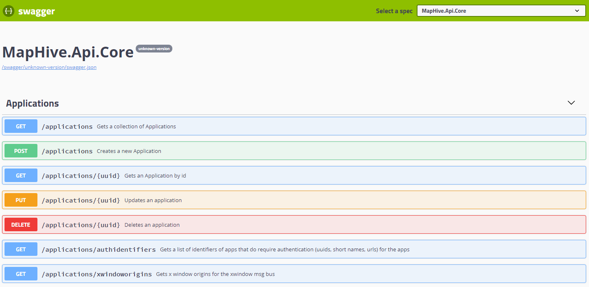
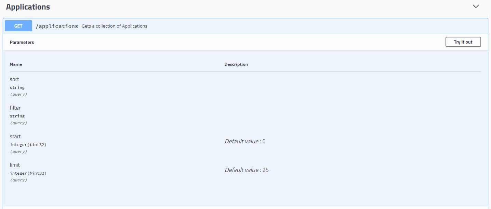
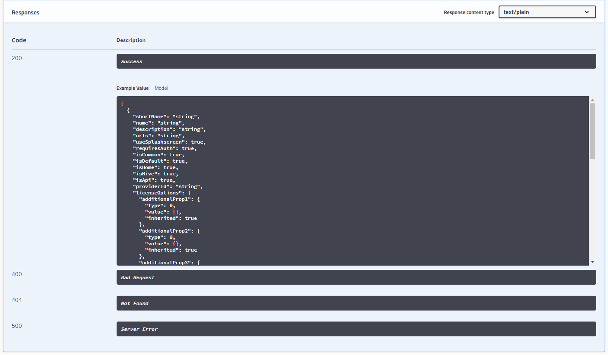
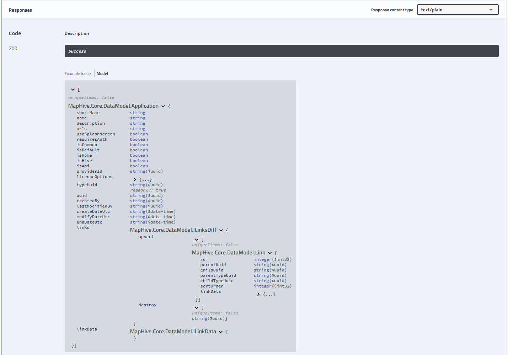
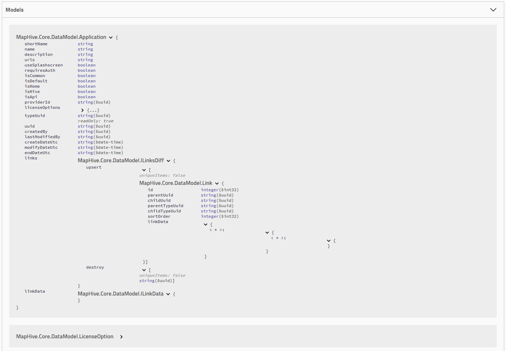

# MapHive.Core.Api - APIs

A complete list of the available APIs of this service can be obtained at [Swagger Docs](../../swagger/).

APIs are groupped by controller and clearly define the HTTP verb such as GET, input models & output models. Depending on the verb, input should be provided via query params for GET requests and via JSON encoded request body for the POST & PUT verbs.

Swagger documentation is generated automatically from the code and hence always presents the information appropriate for the deployed build of the application.

The documentation allows for browsing the APIs by controller / route paths.

The documentation follows the swagger standards and one can easily generate clients for many different languages, for example c# or Java.

The documentation looks similar to:

In the Swagger docs one can easily review the input and output models for all the request types:

GET params:

 Response outputs by response code with example output values:

It is also possible to view the output as Models rather than example value; switching the presentation to models lets one easily obtain fully qualified names of the IO objects:

A separate list of the models used as the IO for the api is listed at the very bottom of the documentation page:

> Model display exposes fully qualified names of the IO objects - these can be used to search the detailed info on the DataModels as described in [Objectmodel](../api/index.html)
> 

> 
> May you find this documentation outdated please please drop us a line...